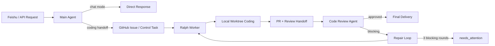

# Marten

<div align="center">

Local-first agent control plane for issue-driven coding and review workflows.

[中文文档](./README_CN.md) · [Architecture](./docs/architecture/agent-system-overview.md) · [Runtime Contracts](./docs/architecture/agent-runtime-contracts.md) · [RAG Surface](./docs/architecture/rag-provider-surface.md) · [Docs Index](./docs/README.md)


</div>

Marten turns `Feishu / GitHub / GitLab / MCP / local worktrees` into one executable agent chain so `Main Agent -> Ralph -> Code Review Agent` can work on real issues, real repositories, and real review loops instead of prompt-only demos.

## Overview

- `Agent-first`, but not prompt-only
- `LLM + skill + MCP` as the primary capability surface
- Local repository execution for coding, testing, and review
- Stable runtime contracts instead of brittle workflow sprawl
- Retrieval provider abstraction with interchangeable vector backends

## Why Marten

Most agent demos stop at planning or generate text against partial context. Marten is built for a narrower but more useful target: take a real request, route it through issue intake, execute code in a real checkout, run review and repair loops, then notify the right channel only after the chain is actually complete.

The repository is opinionated about that boundary:

- MCP is for platform access and external system bridging
- LLMs and skills are for reasoning, coding, and review
- Local worktrees are for real file context, commands, and validation
- JSON-first schemas are preferred over hard-coded orchestration growth

## At A Glance

| Layer | Responsibility |
| --- | --- |
| `channel` | Feishu inbound and outbound delivery |
| `control plane` | task lifecycle, polling, repair loops, final delivery gates |
| `runtime` | model access, skills, MCP bridge, token accounting, provider wiring |
| `agents` | Main Agent, Ralph, Code Review Agent |

## Core Workflow



## Highlights

- Main Agent separates `chat` mode from `coding_handoff` mode
- Ralph works in a local worktree and emits structured coding and review artifacts
- Code Review Agent produces stable machine-readable and human-readable review payloads
- Final delivery is gated on review approval, not just coding completion
- Retrieval stays behind a unified contract while providers can switch between `Qdrant`, `Milvus`, and future backends

## Architecture

Marten is optimized around one stable path:

`Feishu / API -> Main Agent -> GitHub issue -> Ralph coding -> local validation -> review -> final delivery`

That path is the project center of gravity. If a change does not make this chain stronger, safer, or easier to operate, it should be treated as low priority.

Key references:

- [Agent-First Implementation Principles](./docs/architecture/agent-first-implementation-principles.md)
- [Agent System Overview](./docs/architecture/agent-system-overview.md)
- [Agent Runtime Contracts](./docs/architecture/agent-runtime-contracts.md)
- [RAG Provider Surface](./docs/architecture/rag-provider-surface.md)
- [GitHub Issue / PR State Model](./docs/architecture/github-issue-pr-state-model.md)

## Getting Started

### Requirements

- Python `3.11`, `3.12`, or `3.13`
- Git
- a usable LLM provider credential
- optional GitHub / GitLab / Feishu / MCP configuration

### Install

```bash
python3.11 -m venv .venv
source .venv/bin/activate
python -m pip install --upgrade pip
pip install -e .
```

### Configure

```bash
cp .env.example .env
cp mcp.json.example mcp.json
cp models.json.example models.json
cp platform.json.example platform.json
```

Configuration responsibilities:

- `mcp.json`: MCP server command, args, env, cwd, adapter, and external tokens
- `models.json`: provider credentials, API base, default model, and profile bindings
- `platform.json`: repository target and runtime behavior overrides
- `agents.json`: optional agent workspace, skills, MCP servers, prompt spec, model profile
- `.env`: deployment-time overrides, not the primary source of truth

Minimal practical setup:

- `mcp.json`: at least one GitHub MCP server with a valid token
- `models.json`: at least one working model provider
- `platform.json`: at least `github.repository`
- `.env`: only when runtime overrides are needed

### Run

```bash
uvicorn app.main:app --host 0.0.0.0 --port 8000
```

Recommended first checks:

- `GET /health`
- `GET /diagnostics/integrations`
- `POST /main-agent/intake`
- `POST /workers/sleep-coding/poll`

## Local-First Execution

The default path is not "stream a large codebase through MCP into a model." The default path is:

1. Materialize code into a local worktree or checkout.
2. Let the agent read files and run commands locally.
3. Use MCP or platform APIs only for issue, PR, comment, and notification bridges.

Important defaults:

- Ralph uses the built-in agent runtime unless an execution command override is configured
- Review is local-first across intermediate rounds
- Blocking review feedback immediately enters the next repair loop
- Final delivery happens only after review approval

For live end-to-end validation, enable `live_test` in `platform.json` and run:

```bash
python -m unittest tests.test_live_chain -v
```

## RAG And Retrieval

Marten keeps retrieval behind a stable facade so upper layers do not care which vector store is active.

- Provider selection is configuration-driven
- Search and fetch mapping stay normalized at the retrieval layer
- Collection schema and incremental indexing can be handled per provider behind the same contract
- Current validated providers include `Qdrant` and `Milvus`

Design reference:

- [RAG Provider Surface](./docs/architecture/rag-provider-surface.md)

## API Surface

- `GET /health`
- `GET /diagnostics/integrations`
- `POST /gateway/message`
- `POST /webhooks/feishu/events`
- `POST /main-agent/intake`
- `POST /workers/sleep-coding/poll`
- `GET /workers/sleep-coding/claims`
- `GET /control/tasks/{task_id}`
- `GET /control/tasks/{task_id}/events`
- `GET /tasks/sleep-coding/{task_id}`
- `GET /reviews/{review_id}`

## Testing

Run the full test suite:

```bash
python -m unittest discover -s tests -v
```

Important regression areas:

- Main Agent intake and mode routing
- worker polling and claim flow
- Ralph local-first execution artifacts
- review materialization and repair loop control
- retrieval provider contract stability
- MVP end-to-end chain behavior

## Documentation

Recommended reading order:

1. [docs/architecture/agent-first-implementation-principles.md](./docs/architecture/agent-first-implementation-principles.md)
2. [docs/architecture/agent-system-overview.md](./docs/architecture/agent-system-overview.md)
3. [docs/architecture/agent-runtime-contracts.md](./docs/architecture/agent-runtime-contracts.md)
4. [docs/architecture/rag-provider-surface.md](./docs/architecture/rag-provider-surface.md)
5. [docs/evolution/agent-system-rollout-plan.md](./docs/evolution/agent-system-rollout-plan.md)
6. [docs/evolution/rag-provider-rollout-plan.md](./docs/evolution/rag-provider-rollout-plan.md)
7. [docs/handoffs/README.md](./docs/handoffs/README.md)
8. [docs/README.md](./docs/README.md)

## Development Rules

- Do not implement directly on `main`; create or switch to a work branch first
- `docs/handoffs/` is only for handoff rules and templates
- concrete session handoffs belong in local-only `docs/internal/`
- low-value historical execution notes should be deleted instead of force-archived

## Current Scope

The repository is intentionally focused on a single-task production path, not a feature buffet.

In scope:

- request intake to issue creation
- local-first coding and validation
- review, repair, and final delivery
- unified runtime contracts
- pluggable retrieval providers

Not yet expanded:

- multi-repository concurrent scheduling
- multi-reviewer aggregation
- platformized long-term memory and context compression

## Roadmap

- continue reducing issue-only context assumptions
- strengthen source materialization across GitHub and GitLab
- keep shrinking Python fallback paths where the agent runtime can carry the work
- keep public and runtime payload contracts explicit and stable
- keep the repository small enough to debug without losing production utility
