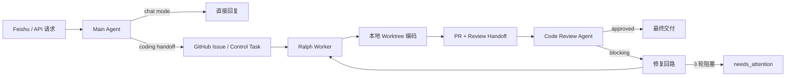

# Marten

<div align="center">

面向 issue 驱动编码与审查链路的 local-first agent control plane。

[English](./README.md) · [架构文档](./docs/architecture/agent-system-overview.md) · [运行时契约](./docs/architecture/agent-runtime-contracts.md) · [RAG 接口](./docs/architecture/rag-provider-surface.md) · [文档索引](./docs/README.md)


</div>

Marten 把 `Feishu / GitHub / GitLab / MCP / 本地 worktree` 收口到一条可执行的 agent 主链路里，让 `Main Agent -> Ralph -> Code Review Agent` 围绕真实 issue、真实仓库与真实 review loop 工作，而不是停留在 prompt demo。

## Overview

- `agent-first`，但不是 prompt-only
- 以 `LLM + skill + MCP` 作为主要能力面
- 编码、测试、审查默认基于本地仓库副本执行
- 用稳定 runtime contract 替代脆弱的流程拼接
- retrieval provider 统一抽象，可切换多个向量库后端

## Why Marten

很多 agent 项目停在“能规划”或“能生成文本”的阶段。Marten 更收敛，也更工程化：把一个真实需求转成 issue，交给真实 worker 在本地代码副本里执行，再经过 review 和 repair loop，最后只有在链路真正通过时才向外部系统交付结果。

这条边界很明确：

- MCP 负责平台访问与外部系统桥接
- LLM 与 skill 负责规划、编码与审查认知
- 本地 worktree 负责真实文件上下文、命令执行与验证
- 优先选择 JSON-first schema，而不是持续扩张的硬编码编排

## At A Glance

| 层 | 职责 |
| --- | --- |
| `channel` | Feishu 输入与通知输出 |
| `control plane` | 任务生命周期、轮询、repair loop、final delivery gate |
| `runtime` | 模型接入、skills、MCP bridge、token 统计、provider 装配 |
| `agents` | Main Agent、Ralph、Code Review Agent |

## Core Workflow



## Highlights

- Main Agent 真实区分 `chat` 与 `coding_handoff`
- Ralph 在本地 worktree 中工作，并产出结构化 coding/review artifact
- Code Review Agent 输出稳定的 machine-readable 与 human-readable review payload
- final delivery 必须经过 review approval gate
- retrieval contract 统一，上层不依赖底层向量库实现

## Architecture

Marten 当前围绕一条主路径持续收口：

`Feishu / API -> Main Agent -> GitHub issue -> Ralph coding -> local validation -> review -> final delivery`

这条链路就是仓库的中心。如果某个改动不能让这条链路更稳、更清晰、更可操作，就不应该成为高优先级。

核心文档：

- [Agent-First Implementation Principles](./docs/architecture/agent-first-implementation-principles.md)
- [Agent System Overview](./docs/architecture/agent-system-overview.md)
- [Agent Runtime Contracts](./docs/architecture/agent-runtime-contracts.md)
- [RAG Provider Surface](./docs/architecture/rag-provider-surface.md)
- [GitHub Issue / PR State Model](./docs/architecture/github-issue-pr-state-model.md)

## Getting Started

### Requirements

- Python `3.11`、`3.12` 或 `3.13`
- Git
- 可用的 LLM provider 凭据
- 可选的 GitHub / GitLab / Feishu / MCP 配置

### Install

```bash
python3.11 -m venv .venv
source .venv/bin/activate
python -m pip install --upgrade pip
pip install -e .
```

### Configure

```bash
cp .env.example .env
cp mcp.json.example mcp.json
cp models.json.example models.json
cp platform.json.example platform.json
```

配置职责：

- `mcp.json`：MCP server 的 command、args、env、cwd、adapter 与外部 token
- `models.json`：provider 凭据、API base、默认模型、profile 绑定
- `platform.json`：仓库目标与运行时行为覆盖
- `agents.json`：可选的 agent workspace、skills、MCP servers、prompt spec、model profile
- `.env`：部署时 override，不应作为主要真相来源

最小可运行配置：

- `mcp.json`：至少一个可用的 GitHub MCP server
- `models.json`：至少一个可用的模型 provider
- `platform.json`：至少配置 `github.repository`
- `.env`：只在需要 runtime override 时使用

### Run

```bash
uvicorn app.main:app --host 0.0.0.0 --port 8000
```

建议优先检查：

- `GET /health`
- `GET /diagnostics/integrations`
- `POST /main-agent/intake`
- `POST /workers/sleep-coding/poll`

## Local-First Execution

默认路径不是“把整份代码通过 MCP 喂给模型”，而是：

1. 先把代码 materialize 到本地 worktree 或 checkout。
2. 再让 agent 在本地目录中读文件、跑命令、生成修改。
3. 只有 issue、PR、comment、通知写回才走 MCP 或平台 API。

关键默认行为：

- Ralph 默认使用内建 agent runtime，除非显式配置 execution command override
- review 中间轮次默认 local-first
- blocking review 发现后立即进入下一轮 repair loop
- final delivery 只在 review approved 后触发

如果要跑真实 live 全链路测试，在 `platform.json` 打开 `live_test` 后执行：

```bash
python -m unittest tests.test_live_chain -v
```

## RAG And Retrieval

Marten 把 retrieval 放在统一 facade 后面，上层无需感知当前启用的是哪种向量库。

- provider 切换由配置驱动
- search / fetch 映射在 retrieval 层统一
- collection schema 与增量索引可由 provider 在同一 contract 后实现
- 当前已验证的 provider 包括 `Qdrant` 与 `Milvus`

设计参考：

- [RAG Provider Surface](./docs/architecture/rag-provider-surface.md)

## API Surface

- `GET /health`
- `GET /diagnostics/integrations`
- `POST /gateway/message`
- `POST /webhooks/feishu/events`
- `POST /main-agent/intake`
- `POST /workers/sleep-coding/poll`
- `GET /workers/sleep-coding/claims`
- `GET /control/tasks/{task_id}`
- `GET /control/tasks/{task_id}/events`
- `GET /tasks/sleep-coding/{task_id}`
- `GET /reviews/{review_id}`

## Testing

运行全量测试：

```bash
python -m unittest discover -s tests -v
```

重点回归区域：

- Main Agent intake 与 mode routing
- worker polling 与 claim 流程
- Ralph 的 local-first execution artifact
- review materialize 与 repair loop 控制
- retrieval provider contract 稳定性
- MVP 主链端到端行为

## Documentation

建议阅读顺序：

1. [docs/architecture/agent-first-implementation-principles.md](./docs/architecture/agent-first-implementation-principles.md)
2. [docs/architecture/agent-system-overview.md](./docs/architecture/agent-system-overview.md)
3. [docs/architecture/agent-runtime-contracts.md](./docs/architecture/agent-runtime-contracts.md)
4. [docs/architecture/rag-provider-surface.md](./docs/architecture/rag-provider-surface.md)
5. [docs/evolution/agent-system-rollout-plan.md](./docs/evolution/agent-system-rollout-plan.md)
6. [docs/evolution/rag-provider-rollout-plan.md](./docs/evolution/rag-provider-rollout-plan.md)
7. [docs/handoffs/README.md](./docs/handoffs/README.md)
8. [docs/README.md](./docs/README.md)

## Development Rules

- 不要直接在 `main` 上实现；先创建或切到工作分支
- `docs/handoffs/` 只放 handoff 规则与模板
- 具体 session handoff 统一放本地 `docs/internal/`
- 无长期价值的历史执行文档直接删除，不强行归档

## Current Scope

这个仓库当前刻意收敛在单任务生产主链，而不是功能拼盘。

当前范围：

- request intake 到 issue 创建
- local-first coding 与 validation
- review、repair、final delivery
- 统一 runtime contract
- 可插拔 retrieval provider

尚未展开：

- 多仓库并发调度
- 多 reviewer 聚合
- 长期记忆与上下文压缩的平台化

## Roadmap

- 继续减少对 issue-only 上下文的依赖
- 继续加强 GitHub / GitLab source materialization 健壮性
- 在 agent runtime 能承担的前提下继续压缩 Python fallback
- 持续把 public/runtime payload contract 显式化与稳定化
- 在不损失生产可用性的前提下保持仓库可调试、可理解
