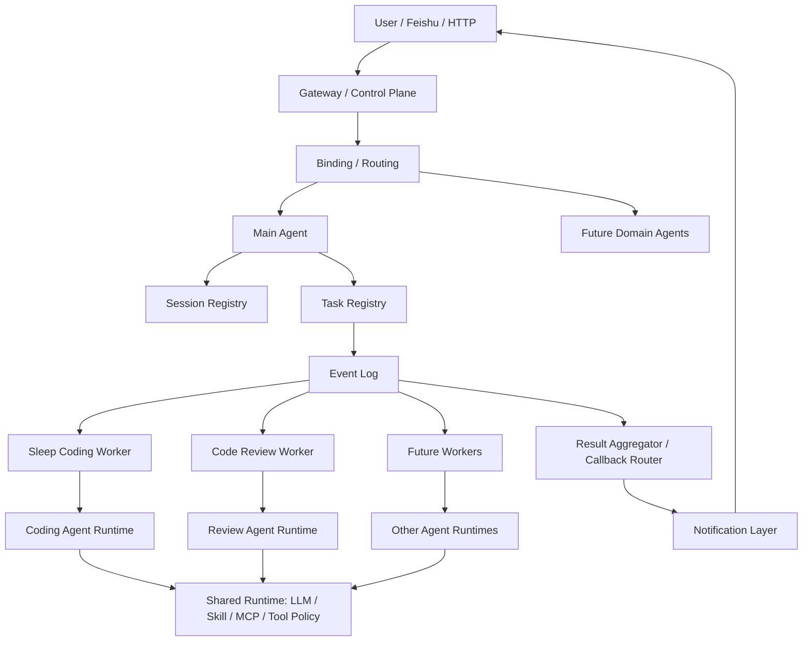

# 多 Agent 平台演进路线图

> 更新时间：2026-03-17
> 目标：在当前 `youmeng-gateway` 多 Agent MVP 基础上，演进为“麻雀虽小，五脏俱全”的长期多 Agent 平台。

## 1. 文档定位

这份文档回答三个问题：

1. 当前项目处在多 Agent 演进的哪个阶段
2. 从 MVP 到长期平台，应该按什么顺序演进
3. 如何借鉴 OpenClaw / OpenCode 的优点，而不把项目过度平台化

这不是替代 [multi-agent-refactor-plan.md](/Users/litiezhu/workspace/github/youmeng-gateway/docs/architecture/multi-agent-refactor-plan.md) 的文档。

两者分工：

- [multi-agent-refactor-plan.md](/Users/litiezhu/workspace/github/youmeng-gateway/docs/architecture/multi-agent-refactor-plan.md)：聚焦当前代码结构改造
- [multi-agent-platform-roadmap.md](/Users/litiezhu/workspace/github/youmeng-gateway/docs/architecture/multi-agent-platform-roadmap.md)：聚焦长期平台演进路径

## 2. 当前项目所处阶段

截至 2026-03-17，当前项目已经具备：

- `Gateway`：FastAPI 统一入口
- `Main Agent`：需求理解、issue intake
- `Ralph`：异步任务接管、plan/coding/PR
- `Code Review Agent`：structured findings、review/repair loop
- `Shared Runtime`：`llm / skills / mcp / agent_runtime`
- `Control Plane v1`：`control_tasks / control_task_events / control_sessions`
- `Worker Governance v1`：`lease / heartbeat / timeout / retry`

当前准确定位是：

> 已完成多 Agent MVP 主闭环，但还不是完整的长期 Agent OS / Agent Platform。

换句话说，现状不是“单 agent 伪装成多 agent”，而是：

> 多 Agent 架构已经成立，但控制平面、上下文治理、运行治理、插件边界仍在第一版。

## 3. 长期目标形态

长期目标不应该只是“功能变多”，而应该形成稳定结构：



这个目标形态借鉴了两类思路：

- `OpenClaw`：Gateway 作为控制平面，Agent 作为独立作用域，session/task/state 是主线
- `OpenCode`：主 agent + subagent + permission/task 边界清晰，子 agent 返回摘要而非回灌全部上下文

参考来源：

- [OpenClaw 整体架构分析](/Users/litiezhu/docs/ytsd/工作学习/AI学习/openclaw/01-整体架构分析.md)
- [OpenClaw 多 Agent 实现与调度](/Users/litiezhu/docs/ytsd/工作学习/AI学习/openclaw/02-多Agent实现与调度.md)
- [OpenCode Agents](https://opencode.ai/docs/agents/)
- [OpenCode Intro](https://opencode.ai/docs/)

## 4. 长期平台必须具备的 8 个能力

如果长期目标是“麻雀虽小，五脏俱全”，那么最少要有下面 8 个能力。

### 4.1 Gateway / Control Plane

必须有一个统一入口负责：

- channel 接入
- binding / routing
- session 管理
- task 管理
- event 管理
- notification
- observability

当前状态：

- 已有第一版
- 仍缺更完整 callback router 和 richer event model

### 4.2 Shared Runtime

所有 agent 共用：

- LLM provider
- skill loader
- MCP client
- tool policy
- structured output contract

当前状态：

- 已具备 `llm / skills / mcp / agent_runtime`
- 仍缺更明确的 tool policy / permission matrix

### 4.3 Agent Workspace System

每个 agent 都应有清晰作用域：

- `AGENTS.md`
- `TOOLS.md`
- workspace-local skills
- allowed MCP servers
- role-specific system instruction

当前状态：

- `main-agent`
- `ralph`
- `code-review-agent`

这条线已经成立。

### 4.4 Session Model

长期平台必须把上下文边界清晰化。

最少三层：

- `user_session`
- `agent_session`
- `run_session`

长期建议增加：

- `thread_session`
- `binding_session`
- `memory_scope`

当前状态：

- `user_session / agent_session / run_session` 已有
- 还没有长期 memory scope

### 4.5 Task / Event Model

长期平台的主线应该是 durable task，而不是 prompt chaining。

需要有：

- parent task
- child task
- event log
- result packet
- retry / timeout / cancel / handoff

当前状态：

- `control_tasks / control_task_events` 已有
- `retry / timeout` 第一版已有
- `cancel / resume / dead-letter` 仍缺

### 4.6 Agent Communication Model

长期平台里，agent 之间不应该直接共享长上下文。

推荐通信对象：

- `task packet`
- `event`
- `result summary`
- `artifact ref`

不推荐：

- agent A 直接把完整聊天历史塞给 agent B
- agent B 执行完成后把完整运行日志灌回 agent A

当前状态：

- 基本正确
- 仍需把 `service direct call` 进一步压缩成 `event + callback`

### 4.7 Run Governance

如果要稳定运行，必须具备：

- lease
- heartbeat
- timeout
- retry
- dead-letter
- cancel
- resume
- manual handoff

当前状态：

- 前四项已有第一版
- 后四项仍缺

### 4.8 Memory / Context Strategy

长期平台不能只有 session 表，还要决定长期记忆策略。

建议分层：

- `Immediate Context`
  来自当前 task packet、workspace、skills、artifacts
- `Session Summary`
  来自主会话和子会话摘要
- `Durable Facts`
  来自 task/event/issue/PR/review 的结构化事实
- `Optional Long-Term Memory`
  来自 OpenViking 或类似 memory system

当前状态：

- Immediate Context 和 Durable Facts 已经有了
- Optional Long-Term Memory 还没有

## 5. 不要盲目照搬 OpenClaw / OpenCode

这两个项目都值得借鉴，但不能直接照抄。

### 5.1 借鉴 OpenClaw 的部分

应借鉴：

- Gateway 是控制平面
- Agent 是独立作用域
- workspace 文件化配置
- binding / routing
- session 是主线
- runtime 与 channel 解耦

不必立刻照搬：

- 全量 Agent OS 目录体系
- 过重的多渠道平台抽象
- 一次性引入完整扩展系统

### 5.2 借鉴 OpenCode 的部分

应借鉴：

- primary agent / subagent 的职责边界
- subagent 只做专项工作
- 子 agent 权限更小
- task 权限和工具权限要清晰
- 子 agent 返回摘要，而不是完整上下文

不必立刻照搬：

- 交互式 terminal-first 的完整产品形态
- 所有 agent 都以用户手动切换为主

### 5.3 你的项目适合的融合方式

最适合 `youmeng-gateway` 的不是纯 OpenClaw，也不是纯 OpenCode，而是：

> OpenClaw 风格的控制平面 + OpenCode 风格的 agent/subagent 边界

## 6. 演进路线

下面是推荐的 5 个阶段。

### 阶段 0：当前 MVP 状态

目标：

- 保证多 Agent 主闭环可用

当前已完成：

- Main Agent intake
- Sleep Coding Worker
- Review Agent
- shared runtime
- task/session/event v1
- worker governance v1

这阶段的关键标准不是“平台完整”，而是“主链路跑通”。

### 阶段 1：把 MVP 收口成稳定控制平面

目标：

- 把“能跑”收口成“稳定可联调”

建议优先做：

1. 真实环境联调闭环
2. `cancel / resume / manual handoff`
3. stuck-task scanner
4. result aggregator / callback router
5. parent task 更明确消费 child summaries

验收标准：

- 任务失败不会默默丢失
- 子 agent 完成后主线状态一定可见
- 用户可以知道任务是成功、失败、超时还是转人工

### 阶段 2：把 Main Agent 从 intake 升级为 supervisor

目标：

- Main Agent 不只是建 issue，而是真正负责全局解释与调度决策

建议做：

1. Main Agent 读取 parent task 全量 child summaries
2. 明确 `callback -> aggregator -> main-agent summary`
3. 对用户只输出压缩后的阶段性摘要
4. 明确主 agent 不再直接调用长任务，只发布 child task

验收标准：

- 主 agent 成为对外解释中心
- 子 agent 变成真正的 durable specialists

### 阶段 3：引入 agent permission / tool policy

目标：

- 把 agent 的工具权限、MCP 权限、bash 权限从“隐式代码约定”变成“显式策略”

建议做：

1. tool permission matrix
2. MCP server allowlist per agent
3. command allowlist / denylist
4. dangerous tool escalation rules
5. audit trail for tool invocation

这一步明显借鉴 OpenCode 的 agent/task/tool permission 思路。参考：

- [OpenCode Agents](https://opencode.ai/docs/agents/)

验收标准：

- `main-agent`、`ralph`、`code-review-agent` 的能力边界清晰可查
- 新增 agent 时不需要靠代码搜索猜权限

### 阶段 4：引入 binding 与多入口会话路由

目标：

- 让系统真正具备多入口、多线程、多身份路由能力

建议做：

1. Feishu 用户 / chat / thread -> binding
2. HTTP source -> binding
3. repo / project / org -> binding strategy
4. agent selection policy
5. default agent / specialized agent 路由规则

这一步明显借鉴 OpenClaw 的 binding 思路。参考：

- [OpenClaw 多 Agent 实现与调度](/Users/litiezhu/docs/ytsd/工作学习/AI学习/openclaw/02-多Agent实现与调度.md)

验收标准：

- 不同来源、不同线程、不同仓库请求可以被确定性路由
- 不再只有“所有请求先走 main-agent”这一种入口模式

### 阶段 5：引入长期记忆层

目标：

- 在任务和会话之外，真正支持长期上下文积累

这一步才是评估 OpenViking 一类上下文系统的合适时机。

建议触发条件：

1. 发现用户长期偏好频繁重复输入
2. 跨 issue / 跨 PR 的知识复用变多
3. Main Agent 需要依赖长期用户背景知识
4. 当前 session/task/event 已不足以支撑上下文压缩

建议做法：

1. 不直接替换 task/session/event
2. 先把长期记忆作为可选层接入
3. 记忆只存“可复用事实 / 用户偏好 / repo 习惯 / 决策摘要”
4. 不把所有运行日志都塞进 memory store

验收标准：

- 长期记忆改善跨任务体验
- 不破坏现有 control plane 的确定性

## 7. 推荐的优先级

长期路线图看起来大，但真正建议顺序很明确：

1. 先做真实环境联调
2. 再补稳定性治理
3. 再升级 main-agent 为 supervisor
4. 再做 permission / binding
5. 最后再做长期 memory

不要反过来。

错误顺序示例：

1. 先接 OpenViking
2. 再做复杂记忆检索
3. 最后才去处理 cancel / stuck / callback

这会导致平台看起来高级，但运行面不稳定。

## 8. 未来推荐的目录演进

当前目录已经够用，但长期建议逐步演进到下面结构：

```text
app/
  api/
  control_plane/
    bindings.py
    callbacks.py
    event_bus.py
    permissions.py
    routing.py
  runtime/
    llm.py
    mcp.py
    skills.py
    agent_runtime.py
    memory.py
  agents/
    main/
    sleep_coding/
    review/
  services/
    adapters/
    channels/
    github/
    gitlab/
```

说明：

- 不是现在就要重构成这样
- 这是长期平台化后的推荐结构

## 9. 路线图的验收口径

只有满足下面这些条件，才可认为项目从 MVP 演进到了长期多 Agent 平台雏形：

1. 主 agent 真正成为 supervisor
2. 子 agent 通过 task/event/result 通信
3. task/session/state 是统一事实源
4. callback / aggregation 成立
5. 权限矩阵成立
6. binding 成立
7. cancel / resume / handoff 成立
8. 长期 memory 是可选增强层，而不是替代控制面

## 10. 当前结论

对 `youmeng-gateway` 而言，最合理的长期方向是：

> 以 `Gateway + Control Plane` 为骨架，  
> 以 `Main Agent / Ralph / Code Review Agent` 为第一层专业 agent，  
> 以 `Shared Runtime` 复用 LLM + skill + MCP，  
> 通过 `task/session/event` 管理上下文和协作，  
> 再在后期引入 binding、permission 和 optional memory。

这条路线既符合你当前的 MVP 目标，也能自然吸收 OpenClaw / OpenCode 的优点，而不会让项目过早掉进“平台先行、业务后补”的陷阱。
