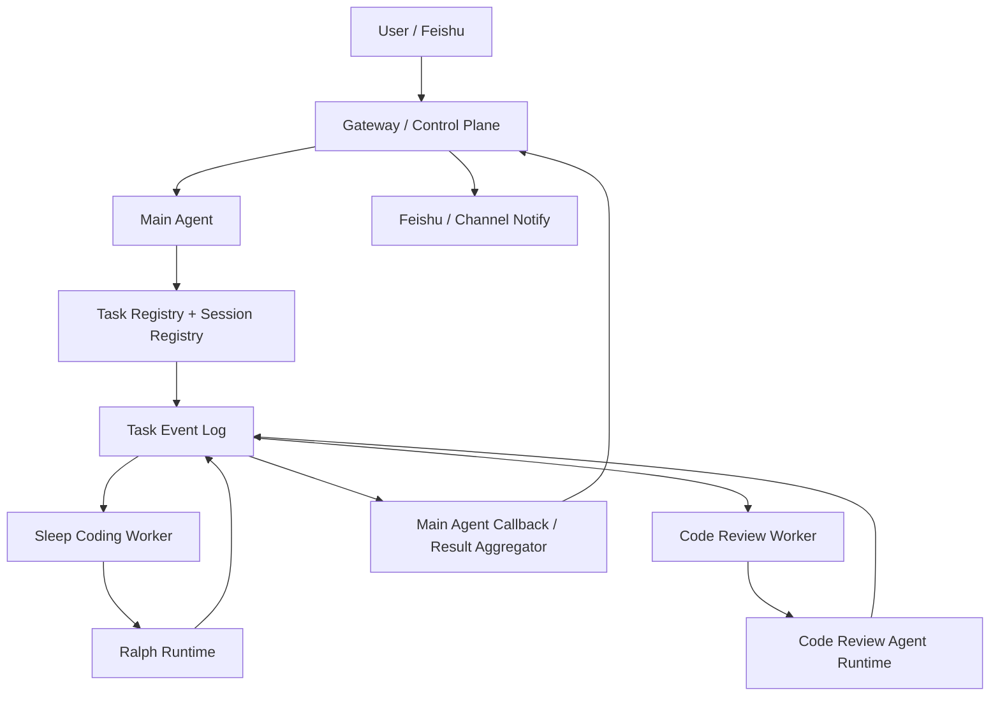

# Multi-Agent 改造方案

> 更新时间：2026-03-17
> 目标：在当前 MVP 已可运行的基础上，把 `youmeng-gateway` 从“可工作的多流程原型”收敛为“可持续扩展的多 Agent 控制平面”。

> 实施进度（2026-03-17）：
> - 已完成：`control_tasks`、`control_task_events`、`control_sessions`、parent/child task 映射、child 结果回写 parent、worker lease / heartbeat / timeout / retry 第一版
> - 未完成：真实环境联调，以及更完整的 stuck-task / cancel / resume 运行治理

## 一、背景与目标

当前项目已经具备 MVP 主链路：

- Feishu / HTTP 入口
- Main Agent 负责 issue intake
- Ralph 负责异步编码与 PR
- Code Review Agent 负责 review 与 repair loop
- shared runtime 负责 `llm / skills / mcp / agent_runtime`

但从长期演进看，当前实现更接近：

> `main-agent intake + worker/automation 状态机`

而不是严格意义上的：

> `Gateway 统一控制平面 + 多 Agent 独立 session + 统一任务状态 + 标准事件通信`

因此需要一份明确的改造方案，兼顾：

1. 短期最小闭环不回退
2. 长期多 Agent 架构逐步收敛
3. 不为了“做平台”而过度抽象
4. 保持 `LLM + skill + MCP` 优先，状态与调度工程化

## 二、设计原则

结合当前实现、OpenClaw 的多 Agent 思路，以及本地 `Multi-Agent` 调研，后续改造遵循以下原则：

1. `Agent First`
   认知工作优先交给 Agent + skill + MCP，控制平面负责执行、状态和治理。

2. `Context Isolation`
   主 Agent 不长期持有编码、review、diff 等大上下文；子 Agent 用独立 session 运行。

3. `Event Driven`
   Agent 之间不直接共享长上下文，统一通过 task/event/result 通信。

4. `Durable Workflow`
   长任务必须可恢复、可观察、可超时、可重试、可人工接管。

5. `Minimal Control Plane First`
   先做最小任务注册表、事件流、session 管理，再考虑更复杂的总线或插件体系。

## 三、对当前架构的判断

### 已合理的部分

- `main-agent` 不继续长期盯住 coding/review，全局上下文没有爆炸。
- `sleep-coding` 和 `review` 已经是独立的认知执行单元。
- `automation` 和任务状态机已经承担了一部分 orchestrator 职责。
- 长任务结果不依赖单次 HTTP 请求存活。

### 当前不足

1. `main-agent` 还是 intake agent，不是真正的 supervisor。
2. 子 Agent 完成后没有标准回调到主 Agent，只是更新状态或直接发通知。
3. `worker / automation / service` 之间的通信仍以直接调用为主，缺少统一事件模型。
4. 没有统一的 session registry，主 Agent 会话、子 Agent 运行、用户线程之间还没完全绑定。
5. 缺少 lease / heartbeat / timeout / dead-letter 这类运行治理能力。

## 四、目标架构

### 4.1 总体结构



### 4.2 核心思想

- `Main Agent` 负责理解用户意图、发起任务、解释结果。
- `Ralph` 和 `Code Review Agent` 作为异步 durable job worker。
- `Task Registry` 是真实主线，不再把 GitHub/SQLite 状态散落为多个局部事实源。
- `Event Log` 作为 Agent 间通信协议，而不是 service 直接互调。
- `Callback / Result Aggregator` 负责把子 Agent 结果压缩成适合主 Agent 或用户消费的摘要。

## 五、主 Agent 与子 Agent 的职责边界

### 5.1 Main Agent

职责：

- 接收用户请求
- 做需求理解与 task decomposition
- 决策是否创建 issue / 启动 coding / 请求 review
- 创建父任务和子任务
- 监听子任务结果摘要
- 向用户做阶段反馈和最终总结

不负责：

- 持有完整编码上下文
- 持有完整 review 上下文
- 自己做分钟级/小时级轮询
- 直接执行长任务循环

### 5.2 Ralph

职责：

- 读取 task context
- 生成 plan / coding draft / patch
- 调用 git/worktree/tools/MCP
- 写回执行结果、验证结果、PR 结果
- 产出结构化 task result

不负责：

- 直接面向用户解释所有中间过程
- 维护主会话上下文
- 自己决定无限次 repair loop

### 5.3 Code Review Agent

职责：

- 获取 review context
- 生成结构化 findings
- 给出 blocking 判定和 repair strategy
- 写回 review artifact 与 comments

不负责：

- 直接驱动多轮全局编排
- 直接管理主用户会话

### 5.4 Gateway / Control Plane

职责：

- binding / routing
- session registry
- task registry
- event append / query
- worker dispatch
- timeout / retry / stuck detection
- user-facing notification

## 六、推荐的通信模型

### 6.1 不推荐的模型

- 主 Agent 把全部上下文传给子 Agent，再等待长时间同步返回
- 子 Agent 完成后直接“回到主上下文”继续推理
- 子 Agent 之间通过拼接 prompt 或共享 memory 直接通信

这会导致：

- 上下文爆炸
- 不可恢复
- 错误排查困难
- 长任务和用户交互耦合过深

### 6.2 推荐的模型

统一使用三类对象：

1. `Session`
   用户线程、主 Agent 会话、子 Agent 运行会话的边界。

2. `Task`
   一个 durable 的工作项，有 parent/child 关系。

3. `Event`
   任务生命周期中的状态变更和结果摘要。

推荐的数据关系：

```text
User Session
  -> Main Agent Session
    -> Parent Task
      -> Child Task (sleep_coding)
      -> Child Task (code_review)
        -> Events
```

### 6.3 事件类型建议

最小事件集：

- `task_created`
- `task_queued`
- `task_started`
- `task_heartbeat`
- `task_result`
- `task_failed`
- `task_timeout`
- `task_cancelled`
- `task_handed_off`

Agent 输出不直接“通知主 Agent”，而是：

1. 子 Agent 产出 `task_result` 或 `task_failed`
2. Event log 持久化
3. Callback / Aggregator 消费事件
4. Main Agent 或 Notification Layer 读取摘要后对外反馈

## 七、Session 管理方案

### 7.1 Session 分层

建议最少区分三层：

1. `user_session`
   对应 Feishu 用户 / 线程 / 会话。

2. `agent_session`
   对应 Main Agent 的用户对话 session。

3. `run_session`
   对应 Sleep Coding / Review 的单次执行上下文。

### 7.2 Session 规则

- 主 Agent session 保留较长历史，但只保留用户交互和任务摘要。
- 子 Agent session 不继承主 Agent 全量历史，只接收最小 task packet。
- 子 Agent 完成后只返回结构化摘要，不回灌全部运行日志。

### 7.3 最小 task packet

给子 Agent 的输入建议固定为：

- `task_id`
- `parent_task_id`
- `session_id`
- `intent`
- `objective`
- `artifacts`
- `constraints`
- `allowed_tools`
- `deadline`
- `budget`

这样子 Agent 的上下文大小稳定，也便于恢复与重试。

## 八、状态管理方案

### 8.1 当前事实源问题

现在状态分散在：

- `sleep_coding_tasks`
- `review_runs`
- `sleep_coding_issue_claims`
- GitHub issue / PR
- Feishu 通知

长期看这会变成多个局部事实源。

### 8.2 目标状态模型

建议逐步收敛为：

1. `sessions`
2. `tasks`
3. `task_events`
4. `task_artifacts`
5. `agent_runs`

其中：

- `tasks` 保存当前快照
- `task_events` 保存完整生命周期
- `agent_runs` 保存每次子 Agent 执行的成本、时长、状态

### 8.3 和现有表的迁移策略

不必一次性重构，可以分两步：

第一步：

- 保留现有 `sleep_coding_tasks` / `review_runs`
- 新增统一 `task_events`
- 所有关键状态变化都写 `task_events`

第二步：

- 引入统一 `tasks` 表做父子任务抽象
- `sleep_coding_tasks` / `review_runs` 退化为 domain-specific payload 表

## 九、错误处理与死循环治理

这是当前架构最需要补的部分之一。

### 9.1 每个子任务必须具备

- `max_runtime_seconds`
- `max_retries`
- `max_repair_rounds`
- `heartbeat_interval_seconds`
- `lease_expires_at`

### 9.2 推荐机制

1. `Lease`
   worker claim task 后必须续租，过期可回收。

2. `Heartbeat`
   子 Agent 定期写心跳事件。

3. `Timeout`
   超过运行时限自动转 `timed_out`。

4. `Retry`
   对临时错误退避重试。

5. `Dead Letter / Manual Handoff`
   超过重试/轮次上限后转人工。

### 9.3 主 Agent 的处理方式

主 Agent 不应该自己盯死循环。

正确做法：

- 控制平面检测 `timeout / stuck / failed`
- 生成 `task_failed` 或 `task_handed_off` 事件
- Main Agent 只接收摘要：
  - 失败原因
  - 已重试次数
  - 下一步建议

## 十、短期改造方案：最小闭环

这是下一阶段最值得先落的内容。

### Phase A：把当前原型收敛成最小控制平面

目标：

- 不推翻已有代码
- 把“service 互调”收敛成“任务 + 事件 + 回调”

建议改动：

1. 新增统一 `tasks` / `task_events` 表
2. Main Agent 创建 parent task
3. Sleep Coding / Review 作为 child task
4. `automation` 不再直接 while-loop 互调，而是消费 task state
5. 子 Agent 完成后写 `task_result` 事件
6. Notification / Main callback 消费结果事件

### Phase B：补 session registry

目标：

- 让用户线程、主会话、子任务执行真正绑定起来

建议改动：

1. 新增 `sessions` 表
2. Feishu 线程 / 用户 -> `user_session`
3. Main Agent 会话 -> `agent_session`
4. 每次 child run -> `run_session`

### Phase C：补运行治理

目标：

- 避免 stuck task、死循环、无限 repair

建议改动：

1. worker lease
2. heartbeat
3. timeout supervisor
4. retry policy
5. manual handoff queue

## 十一、长期演进方案

### 11.1 目标架构形态

长期目标不是“让主 Agent 持续指挥所有子 Agent”，而是：

> `Main Agent = 面向用户的控制层`
>
> `Sub Agents = durable workers`
>
> `Control Plane = session/task/event/state governance`

### 11.2 推荐的长期模块

- `channel/`
- `control_plane/`
- `runtime/`
- `agents/`
- `workers/`
- `state/`
- `notifications/`

### 11.3 是否需要消息总线

MVP 阶段不必须。

建议顺序：

1. 先用 SQLite/PostgreSQL + scheduler + task_events
2. 足够稳定后，再评估 Redis streams / NATS / Kafka

也就是说，当前阶段不建议为了“多 Agent”过早引入复杂 MQ。

## 十二、建议的实施顺序

1. 引入统一 `tasks + task_events`
2. 把 `automation` 改成事件驱动回调，而不是 service 同步编排
3. 引入 `sessions` 表和 session registry
4. 给 worker 增加 lease / heartbeat / timeout / retry
5. 让 Main Agent 改成真正的 parent task supervisor
6. 最后再考虑更复杂的 agent-to-agent 协作模式

## 十三、对当前 MVP 的结论

当前实现已经适合继续作为 MVP 代码底座，但从多 Agent 架构标准来看，仍需明确：

- `main-agent` 目前更像 intake agent，而不是真正的 supervisor
- `ralph` 和 `code-review-agent` 已有雏形，但通信仍以 service 互调为主
- `shared runtime` 已经具备长期收敛基础
- 下一阶段的关键不再是增加更多 Agent，而是补齐：
  - 统一状态管理
  - 主子 Agent 通信
  - session 管理
  - 运行治理

## 十四、最终建议

对本项目，最适合的路线不是“主 Agent 长期持有上下文并轮询子 Agent”，而是：

> `Main Agent 发起任务 + 控制平面跟踪状态 + 子 Agent 异步执行 + 事件回调返回摘要 + Main Agent 负责用户层解释`

这条路线兼顾：

- 避免上下文爆炸
- 保持任务可恢复
- 支持长任务
- 支持后续扩更多 Agent
- 不需要过早自研复杂平台
